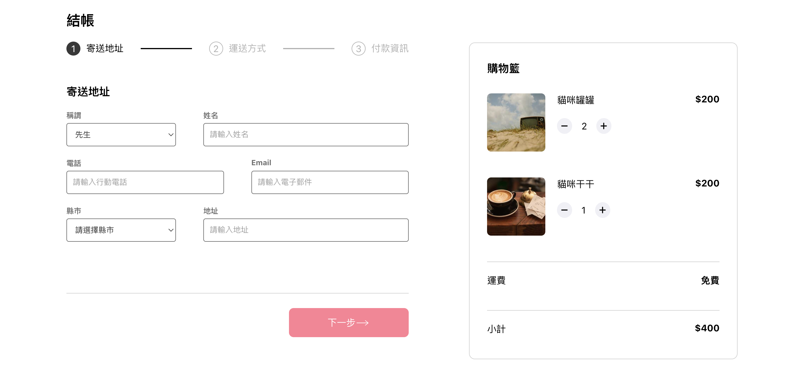

# Alpha Shop 1

虛構電商 Alpha Shop 的結帳模擬頁面



## Features 功能

- 對已加入購物車的商品進行結帳的模擬畫面(不含實際互動功能)
- 模擬結帳流程進度顯示
- 模擬付款資訊填寫欄位
- 模擬結帳流程控制按鈕
- 模擬顯示購物車商品清單

## Prerequisites 環境建置與需求

- Node.js 14.18.1
- React 18.2.0

## Installation and execution 安裝與執行

1. 請先確認有安裝 node.js 與 npm
2. 將專案 clone 到本地
3. 在本地開啟之後，透過終端機進入資料夾，輸入：

   ```bash
   npm install
   ```

4. 安裝完畢後，繼續輸入：

   ```bash
   npm start
   ```

5. 打開瀏覽器進入到此網址： http://localhost:3000

6. 若欲暫停使用

   ```bash
   ctrl + c
   ```
